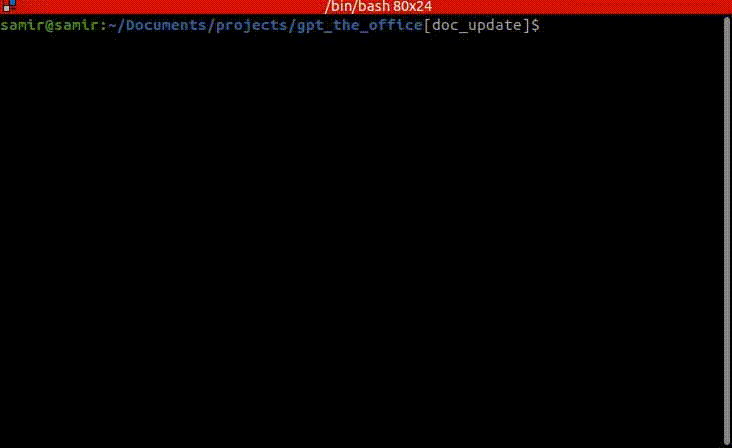
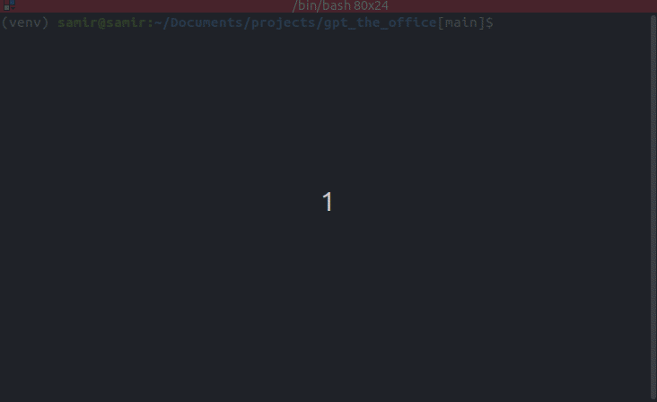
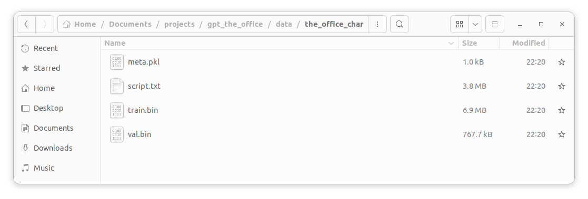
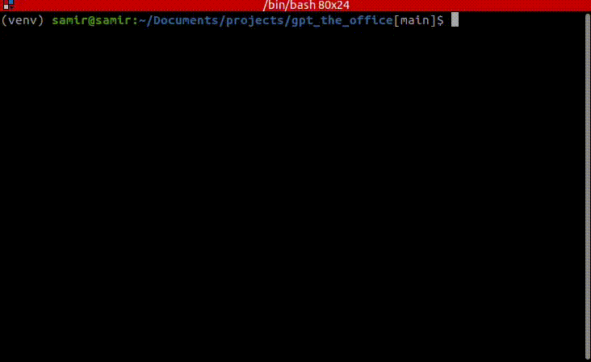
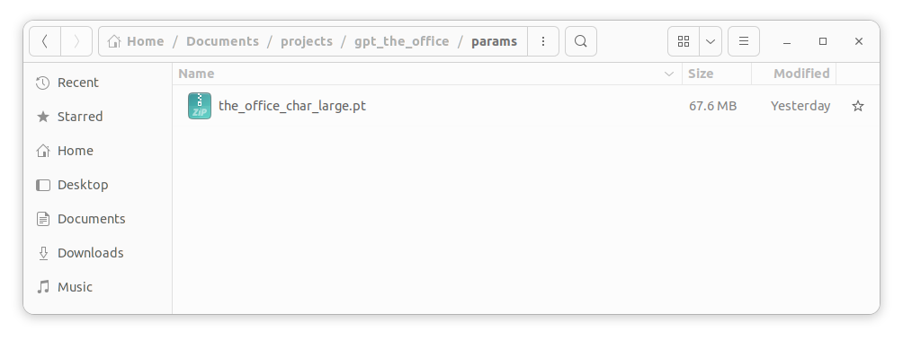
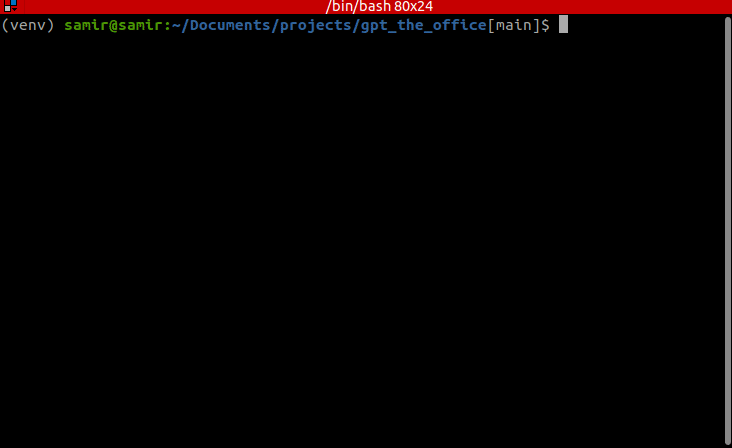
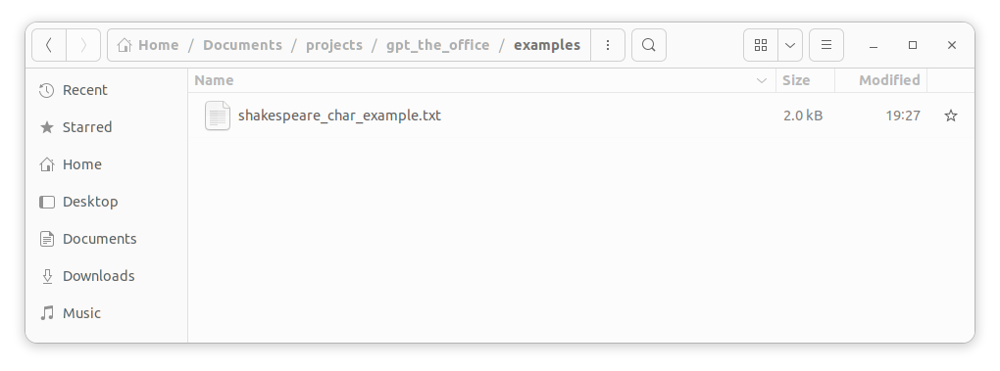

# gpt_the_office

## Background

We are creating a simple gpt (Generative Pre-trained Transformer) that can learn writing texts given a dataset. The motivation behind this repo is to create scripts from `The Office`. The first iteration will be utilizing character-wise tokens. Inspiration came from Andrej Karpathy and his video [here](https://www.youtube.com/watch?v=kCc8FmEb1nY). For simplicity sake, this will utilize one GPU.

## Quick Start

### Setting up the environment

We need to make sure that our environment has all the required packages to run this repo.
We shall create a virtual environment to ensure this.

Assumption is you have python3, using pip, and a linux os.

1. `gh repo clone shassen14/gpt_the_office` (or however you would like to clone the repo)
2. `cd gpt_the_office`
3. `sh set_environment.sh` or `bash set_environment.sh`

Here is a gif to showcase a similar procedure and expected output:

If one is not running linux, then do something similar to the following:

1. `gh repo clone shassen14/gpt_the_office` (or however you would like to clone the repo)
2. `cd gpt_the_office`
3. `pip3 install virtualenv` (if you don't already have virtualenv installed)
4. `python3 -m venv ./venv` to create your new environment (called 'venv' here)
5. `source venv/bin/activate` to enter the virtual environment
6. `pip3 install -r requirements.txt` to install the requirements in the current environment

### Obtaining the dataset

We need to have a dataset to train and validate our gpt model is generating "correct" text.
We shall download a set from an online source before training a model.

1. Ensure one is in the virtual environment with `source venv/bin/activate`
2. `python3 ./data/prep_char_data.py`

This will then create a character-level dataset directory that has the `meta.pkl`, `script.txt`, `training.bin`, and `val.bin`. The following gif shows the steps and example terminal outputs:

An example for the dataset directory created is the following:

This will rather download the dataset or confirm it's already there. One can edit the `data/data_config.py` to edit file names and download another dataset recommended in the comments or one's own.

### Training

We shall train a gpt model given a dataset downloaded in the previous section.

1. Ensure one is in the virtual environment with `source venv/bin/activate`
2. `python3 train.py`

The terminal output shows the estimated training loss, validation loss, and an example text from that checkpoint.
Here is an example terminal output from training a model for ~10 minutes sped up:

A `.pt` model should have been saved in the `params` directory like the following:

### Generation

Once we trained a gpt model, we can now create some screenplays by generating texts.

1. Ensure one is in the virtual environment with `source venv/bin/activate`
2. `python3 generation.py`

The terminal output shows text printing line by line utilizing the model saved from the training section.
Here is an example in the following:

The generated text shown in the terminal should also be saved as a `.txt` file in the `examples` directory
such as the following:

## Future Plans

- [x] Collect different level of tokens via tiktoken (what gpt2 uses)
- [x] Create a gpt model based off of [Attention is all you need](https://arxiv.org/pdf/1706.03762.pdf)
- [x] Save parameters
- [x] Organize parameters
- [x] Organize gpt model directory. might make it one file?
- [x] Have a train.py for training and a generate.py for running models given parameters
- [x] Need to rename main.py to something else -> train.py
- [x] Save parameters midway. Have the ability to resume training if stopped midway
- [x] Simplify environment setup
- [x] Things are getting more serious. name cfg files with context
- [x] Webscrape for the office screenplay
- [x] add readme in data
- [ ] add a tutorial section where people can create models of their own in the readme
- [ ] add readme in config
- [ ] add readme in models
- [ ] Give context text to the generation step
- [ ] Need better visualization (wandb?). This will help understand under the hood parameters
- [ ] argparse to overwrite some variables. Main one is to resume or start

- [ ] Might split configs differently. Optimizer params split with model creation params. Haven't decided yet
- [ ] Might include docker as well for environment setup?

- [ ] Instead of print statements, use logging library
- [ ] Maybe one day when I blessed to have a GPU cluster, I'll write this utilizing PyTorch's FSDP for parrallel computing
