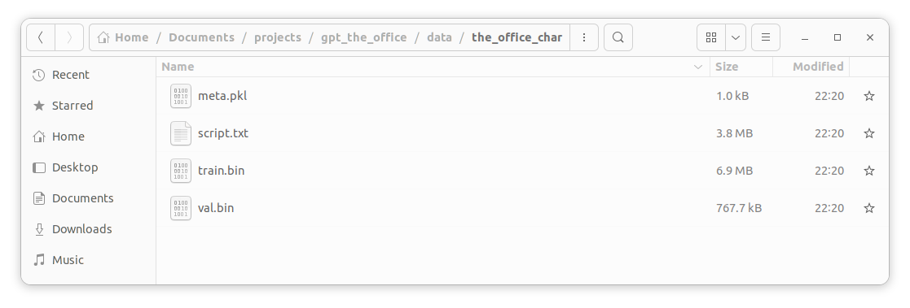

# data

This directory's purpose is to download language datasets on the web, create a training and validation set, and finally any metadata to help later on

## Guide

### data_config.py

Edit this file to one's desire to download a specific `*.txt` to download, parse, and create necessary files for later use. The default is a dataset I collected from `The Office`

```python
folder_name = "the_office"  # directory name to create all files in
url = "https://raw.githubusercontent.com/shassen14/datasets/main/the_office/main_script.txt"  # dataset to download
```

### prep_char_data.py

This file doesn't need any editing if downloading a `*.txt` file. Just simply run `python3 prep_char_data.py` and it will create a `*_char` directory where there will be `meta.pkl`, `script.txt`, `training.bin`, and `val.bin` created. The default is `the_office_char`.



### prep_tiktoken_data.py

This file doesn't need editing (for the most part) if downloading a `*.txt` file. Just simply run `python3 prep_tiktoken_data.py` and it will create a `*_"token_type"` directory where there will be `meta.pkl`, `script.txt`, `training.bin`, and `val.bin` created. The default is `the_office_gpt2`.

The area that will probably need editing if need be is the following example:

```python
vocab_size = 50257
tiktoken_model = "gpt2"
```

One can change the token model and vocab size related to that model from OPENAI's tiktoken library [here](https://github.com/openai/tiktoken).

## TODO

1. Utilize [openwebtext](https://github.com/jcpeterson/openwebtext) to have a general-purpose model first. Then finetune with `The Office` dataset or any other one wants. Need to create a `prep_openwebtext.py` file
2. Have `vocab_size` and `tiktoken_model` configurable.
3. Test other tiktoken models and add it to list of suggestions
